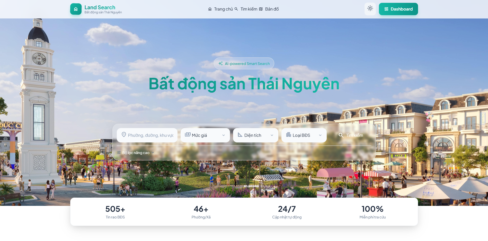

# Land Search - Real Estate Aggregator

<p align="center">
  
  
  
  
</p>

> An intelligent real estate listing aggregator that scrapes Facebook Groups, uses AI to extract and normalize property information, and provides a powerful dashboard for managing listings.

## Preview



---

## Features

| Feature | Description |
|---------|-------------|
| **Facebook Scraping** | Import real estate posts from JSON files scraped from Facebook Groups |
| **AI-Powered Extraction** | Uses LLMs (Ollama with gpt-oss:120b-cloud) to intelligently extract property information |
| **Data Normalization** | Standardizes prices, areas, addresses, phone numbers, and property features |
| **Direction Extraction** | Identifies house orientations from various Vietnamese text formats |
| **Feature Classification** | Categorizes 11+ property feature groups (legal, location, infrastructure, etc.) |
| **Image Management** | Downloads and stores property images locally |
| **Dashboard** | Admin interface for browsing, searching, and managing listings |
| **Settings Management** | Configure AI providers and API keys via dashboard UI |
| **Batch Processing** | Queue-based import with progress tracking and error handling |
| **Duplicate Detection** | SHA-256 hashing to prevent duplicate entries |
| **Confidence Scoring** | AI extraction confidence levels for data quality tracking |

---

## Tech Stack

| Category | Technology |
|----------|------------|
| **Framework** | Laravel 11 |
| **Language** | PHP 8.2+ |
| **Database** | MySQL 8.0+ |
| **Queue** | Database Driver |
| **Cache** | Database Cache |
| **AI Provider** | [Ollama](https://ollama.com) |
| **NLP** | Custom Vietnamese text processing |
| **Frontend** | Blade Templates + Tailwind CSS |

---

## Getting Started

### Prerequisites

- PHP 8.2 or higher
- Composer 2.x
- MySQL 8.0+ or SQLite
- Node.js (optional)
- Ollama API (https://ollama.com)

### Installation

```bash
# 1. Clone the repository
git clone https://github.com/yourusername/land-search-v2.git
cd land-search-v2

# 2. Install dependencies
composer install

# 3. Copy environment file
cp .env.example .env

# 4. Generate application key
php artisan key:generate

# 5. Run database migrations
php artisan migrate

# 6. Create storage link
php artisan storage:link

# 7. Start the development server
php artisan serve
```

### Running the Queue Worker

```bash
php artisan queue:work

# Or with options
php artisan queue:work --sleep=3 --tries=3 --timeout=60
```

---

## AI Configuration

AI settings are managed via the **Dashboard Settings** (stored in database, not `.env` file).

### Settings Dashboard

1. Navigate to `/dashboard/settings`
2. Configure your AI provider
3. Save - settings are stored in the database

### Default Settings

| Key | Description | Default |
|-----|-------------|---------|
| `ai.provider` | AI provider to use | `ollama` |
| `ai.ollama_url` | Ollama API endpoint | `https://ollama.com` |
| `ai.ollama_model` | Model name | `gpt-oss:120b-cloud` |
| `ai.ollama_api_key` | API key (if required) | - |

### Ollama Setup

```bash
# Install Ollama
curl -fsSL https://ollama.com/install.sh | sh

# Pull the model
ollama pull gpt-oss:120b-cloud

# Or use an alternative model
ollama pull llama3.2

# Verify Ollama is running
curl https://ollama.com/api/tags
```

---

## Usage

### Configuring AI Provider

1. Go to `/dashboard/settings`
2. Enter the Ollama API endpoint
3. Enter model name and API key
4. Click "Save" to apply changes

### Importing Data

1. Navigate to `/dashboard/import/create`
2. Upload a JSON file from your Facebook scraper
3. Click "Import"
4. Monitor progress at `/dashboard/import/{id}`

### JSON Import Format

```json
[
  {
    "url": "https://facebook.com/groups/.../posts/...",
    "text": "Bán nhà 3 tầng, 120m2, hướng Đông Nam...",
    "user": {
      "id": "123456",
      "name": "Nguyen Van A"
    },
    "attachments": [
      {"photo_image": {"uri": "https://scontent.fbcdn.net/..."}}
    ],
    "published_at": "2026-05-10T12:00:00Z"
  }
]
```

### Managing Posts

| Endpoint | Description |
|----------|-------------|
| `GET /dashboard/posts` | Browse all listings |
| `GET /dashboard/posts/{id}` | View listing details |
| `PUT /dashboard/posts/{id}` | Edit listing manually |

---

## AI Pipeline

### Pipeline Stages

| Stage | Description |
|-------|-------------|
| **Text Preprocessing** | Cleans and normalizes raw Vietnamese text |
| **Prompt Engineering** | Generates optimized prompts for LLM extraction |
| **LLM Extraction** | Calls AI provider to extract structured data |
| **Validation** | Validates extracted data against schemas |
| **Normalization** | Standardizes values (prices, areas, directions) |
| **Storage** | Saves processed data to database |

### Feature Groups

Features are classified into 11 categories:

| Group | Code | Examples |
|-------|------|----------|
| Basic Info | `basic_info` | Bedrooms, bathrooms, floors |
| Location | `location` | Near market, school, hospital |
| Infrastructure | `infrastructure` | Road access, utilities |
| Legal | `legal` | Land title, ownership verified |
| Land | `land` | Regular shape, corner lot |
| House | `house` | Garage, garden, new construction |
| Investment | `investment` | High liquidity, good ROI |
| Environment | `environment` | Good security, quiet area |
| Suitable For | `suitable_for` | Family living, investment |
| Status | `status` | Under construction, completed |
| Direction | `direction` | East, Southeast, etc. |

---

## License

This project is open-sourced under the [MIT License](LICENSE).

---

<p align="center">
  Built with ❤️ using <a href="https://laravel.com" target="_blank">Laravel</a>
</p>
